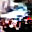
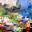

# Joint Energy-based Models

Here is a rough implementation of [Your Classifier is Secretly an Energy Based Model and You Should Treat It Like One](https://arxiv.org/abs/1912.03263) (Grathwohl, Wang, Jacobsen, Duvenaud, Norouzi, Swersky, 2019).

The code is hacked together and there are certainly more than a few bugs. I expect to clean it up and fully replicate the paper's results in the coming week.

Currently (Wednesday 12/11) I have only trained a small resnet to 50% accuracy on 10% of CIFAR10. Although training becomes very unstable towards the end, the generated samples are promising.

Generally I stopped the samples towards the right earlier so they are noiser and less mode-collapsey:

Class | Samples |
--- | ---
Plane |   
Car |    
Bird |    
Cat |   
Deer |   
Dog |   
Frog |   
Horse |   
Ship |   
Truck |   

Next steps, roughly in order:
 - Make the restart code more sophisticated so I can train longer without babysitting it so much. Currently it diverges a LOT and the auto restart only works maybe 50% of the time.
 - Train on all of CIFAR10 to convergence
 - Make some pretty plots of inception scores (I know, they're considered harmful)
 - Clean up the code so others can train and generate samples
 - Try and figure out methods to stabilize training (SGLD & loss tuning)

